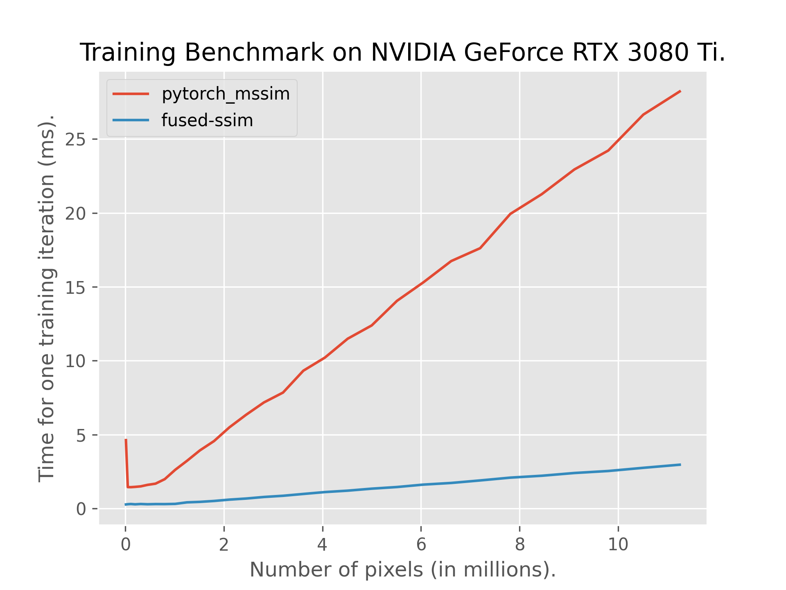
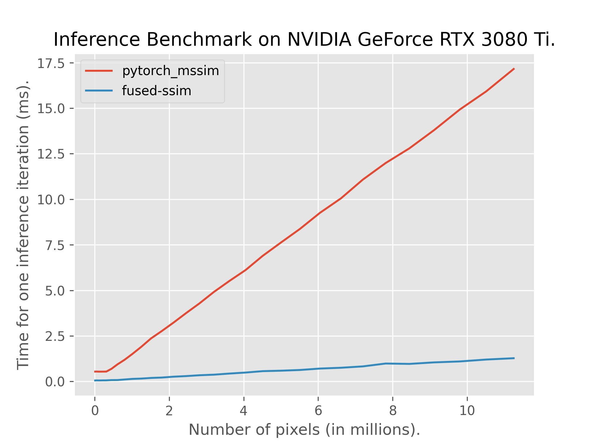

# Fully Fused Differentiable SSIM

This repository contains an efficient fully-fused implementation of [SSIM](https://en.wikipedia.org/wiki/Structural_similarity_index_measure) which is differentiable in nature. There are several factors that contribute to an efficient implementation:
- Convolutions in SSIM are spatially localized leading to fully-fused implementation without touching global memory for intermediate steps.
- Backpropagation through Gaussian Convolution is simply another Gaussian Convolution itself.
- Gaussian Convolutions are separable leading to reduced computation.

As per the original SSIM paper, this implementation uses `11x11` sized convolution kernel. The weights for it have been hardcoded and this is another reason for it's speed. This implementation currently only supports **2D images** but with **variable number of channels** and **batch size**.

## PyTorch Installation Instructions
- You must have CUDA and PyTorch+CUDA installed in you Python 3.X environment. This project has currently been tested with PyTorch `2.3.1+cu118` and CUDA `11.8` on Ubuntu 24.04 LTS.
- Run `pip install git+https://github.com/rahul-goel/fused-ssim/` or clone the repository and run `pip install .` from the root of this project.

## Usage
```python
import torch
from fused_ssim import fused_ssim

# predicted_image, gt_image: [BS, CH, H, W]
# predicted_image is differentiable
gt_image = torch.rand(2, 3, 1080, 1920)
predicted_image = torch.nn.Parameter(torch.rand_like(gt_image))
ssim_value = fused_ssim(predicted_image, gt_image)
```

By default, `same` padding is used. To use `valid` padding which is the kind of padding used by [pytorch-mssim](https://github.com/VainF/pytorch-msssim):
```python
ssim_value = fused_ssim(predicted_image, gt_image, padding="valid")
```

If you don't want to train and use this only for inference, use the following for even faster speed:
```python
with torch.no_grad():
  ssim_value = fused_ssim(predicted_image, gt_image, train=False)
```

## Constraints
- Currently, only one of the images is allowed to be differentiable i.e. only the first image can be `nn.Parameter`.
- Limited to 2D images.
- Images must be normalized to range `[0, 1]`.
- Standard `11x11` convolutions supported.

## Performance
This implementation is 5-8x faster than the previous fastest (to the best of my knowledge) differentiable SSIM implementation [pytorch-mssim](https://github.com/VainF/pytorch-msssim).

 

## Acknowledgements
Thanks to [Bernhard](https://snosixtyboo.github.io) for the idea.
